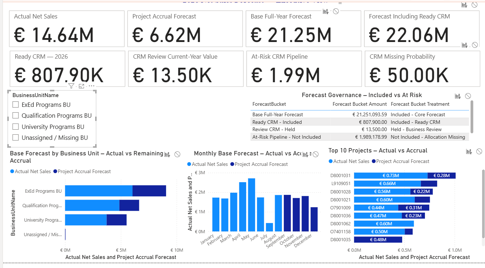
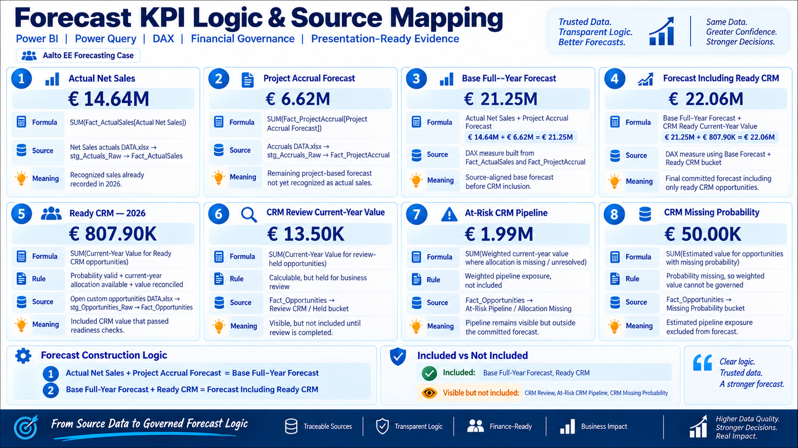
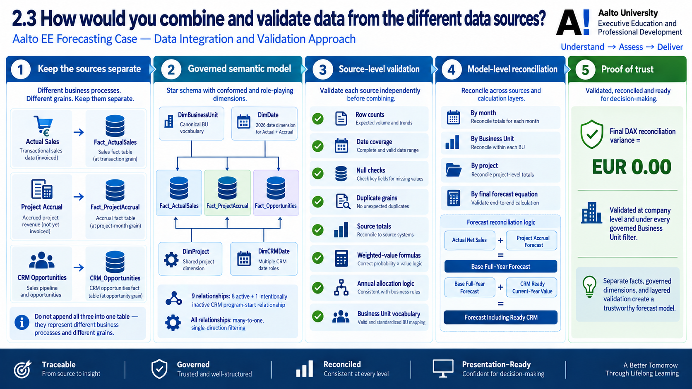
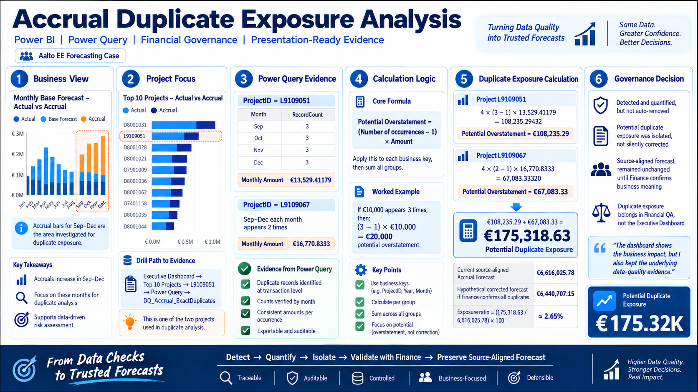
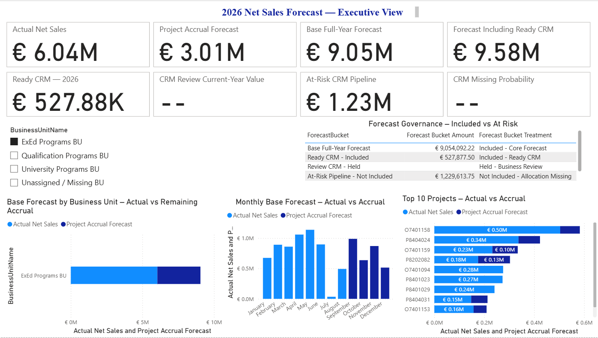
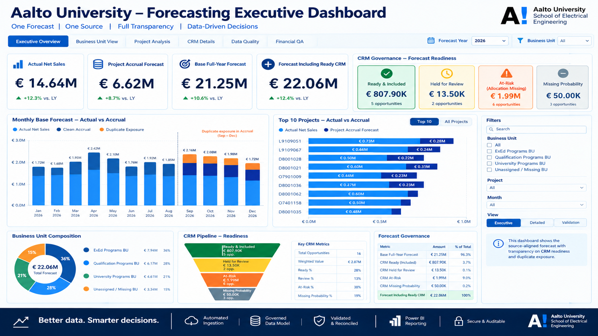
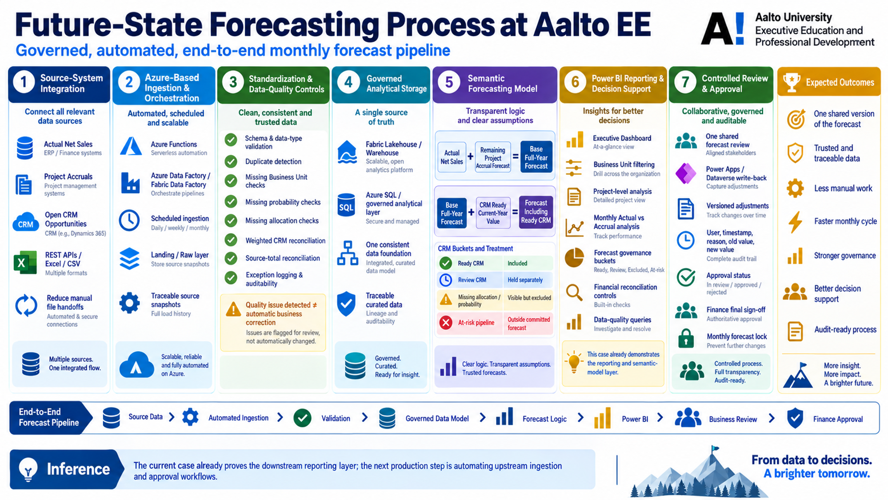

# Aalto EE Net Sales Forecasting Case — Power BI, Power Query & Forecast Governance

> **Portfolio case study:** a governed 2026 net-sales forecasting prototype built in Microsoft Power BI Desktop and Power Query, combining Actual Net Sales, Project Accruals and CRM opportunities into one traceable forecasting model.



## Overview

This repository contains the working files, source datasets, implementation report and presentation assets for a forecasting case prepared for a **Data Analyst / Engineer** interview at **Aalto University Executive Education and Professional Development (Aalto EE)**.

The goal was not to build only a dashboard. The solution was designed as a small governed forecasting system with:

- separate source and analytical layers;
- explicit data-quality controls;
- a star-schema semantic model;
- financial reconciliation;
- CRM forecast-readiness rules;
- Business Unit and Project analysis;
- duplicate-risk quantification without silently changing source data;
- an executive reporting layer in Power BI.

The implementation report documents the full build, controls, validation results and design decisions.

---

## Key forecast results

| KPI | Result |
|---|---:|
| Actual Net Sales | **€14,635,067.81** |
| Project Accrual Forecast | **€6,616,025.78** |
| Base Full-Year Forecast | **€21,251,093.59** |
| Ready CRM — 2026 | **€807,900.00** |
| Forecast Including Ready CRM | **€22,058,993.59** |
| CRM Review — Held | **€13,500.00** |
| At-Risk CRM Pipeline | **€1,989,178.99** |
| CRM Missing Probability exposure | **€50,000.00** |
| Potential Accrual Duplicate Exposure | **€175,318.63** |

### Core forecast equations

```text
Base Full-Year Forecast
= Actual Net Sales + Project Accrual Forecast

= €14,635,067.81 + €6,616,025.78
= €21,251,093.59
```

```text
Forecast Including Ready CRM
= Base Full-Year Forecast + CRM Ready Current-Year Value

= €21,251,093.59 + €807,900.00
= €22,058,993.59
```

The final reconciliation controls return **€0.00 variance** for both equations at company level and under the governed Business Unit filters.

---

## Forecast KPI logic and source mapping



The model intentionally separates financial meanings instead of adding every available CRM value into one number.

### 1. Actual Net Sales

Recognized 2026 sales from the Actual Sales source.

```DAX
Actual Net Sales =
SUM ( Fact_ActualSales[ActualNetSales] )
```

### 2. Project Accrual Forecast

Remaining project-based forecast for the September–December period.

```DAX
Project Accrual Forecast =
SUM ( Fact_ProjectAccrual[ProjectAccrualForecast] )
```

### 3. Base Full-Year Forecast

```DAX
Base Full-Year Forecast =
[Actual Net Sales] + [Project Accrual Forecast]
```

### 4. Forecast Including Ready CRM

Only CRM opportunities that pass the forecast-readiness rules are added.

```DAX
Forecast Including Ready CRM =
[Base Full-Year Forecast] + [CRM Ready Current-Year Value]
```

---

## Source data

Three supplied Excel datasets represent different business processes and therefore remain separate facts rather than being appended into one table.

| Source | Business meaning | Main analytical fact |
|---|---|---|
| `Net Sales actuals DATA.xlsx` | Recognized net sales by Business Unit, Project and accounting month | `Fact_ActualSales` |
| `Accruals DATA.xlsx` | Forecasted accrued net sales for ongoing projects | `Fact_ProjectAccrual` |
| `Open custom opportunities DATA.xlsx` | Open CRM opportunities with estimated value, probability and annual allocation | `Fact_Opportunities` |

See [`data/README.md`](data/README.md) for additional notes.

---

## Power Query architecture

The project uses a layered Power Query structure:

```text
01_Staging
├── stg_Actuals_Raw
├── stg_Accruals_Raw
└── stg_Opportunities_Raw

02_Facts
├── Fact_ActualSales
├── Fact_ProjectAccrual
└── Fact_Opportunities

03_Data_Quality
├── DQ_Actual_DuplicateKeys
├── DQ_Accrual_SourceTotal
├── DQ_Accrual_ExactDuplicates
├── DQ_Accrual_RepeatedBusinessKeys
├── DQ_Opportunity_WeightedValueMismatch
├── DQ_Opportunity_CurrentYearWeightedStatus
├── DQ_Opportunity_AllocationValidation
├── DQ_Opportunity_AllocationStatusSummary
├── DQ_Opportunity_AllocationExceptions
├── DQ_Opportunity_MissingAllocationByYear
├── DQ_Opportunity_2026MissingAllocationDetail
├── DQ_Opportunity_2026MissingAllocationExposure
├── DQ_Opportunity_2026CurrentYearAllocationRisk
├── DQ_Opportunity_2026ForecastReadinessSummary
├── DQ_Opportunity_2026ForecastReadinessStatusSummary
├── DQ_Opportunity_2026ForecastBridge
└── DQ_BusinessUnit_SourceValues

04_Dimensions
├── DimBusinessUnit
├── DimDate
├── DimCRMDate
└── DimProject
```

Staging and data-quality queries are retained for lineage and auditability but are not loaded as business-facing semantic-model tables.

---

## Semantic model



The model uses separate facts connected through governed dimensions.

### Dimensions

- `DimBusinessUnit` — canonical Business Unit vocabulary plus an explicit `Unassigned / Missing BU` member.
- `DimDate` — complete 2026 date dimension used by Actual Sales and Project Accrual.
- `DimCRMDate` — 2024–2028 calendar supporting multiple CRM date roles.
- `DimProject` — shared project dimension with 252 unique ProjectIDs.
- `DimForecastBucket` — disconnected presentation dimension for governed forecast treatments.

### Relationship design

The final model contains **9 relationships**:

- **8 active** relationships;
- **1 intentionally inactive** CRM relationship for `SimulatedProgramStartDate`;
- all fact-to-dimension paths use many-to-one cardinality with **single-direction filtering**.

This avoids fact-to-fact filtering and keeps the model explainable and auditable.

---

## Data validation and governance

Validation is performed before and after semantic modelling.

### Source-level controls

- explicit data types;
- Trim / Clean text standardization;
- row-count validation;
- date validation;
- null and missing-value checks;
- duplicate-grain checks;
- source-total reconciliation;
- CRM weighted-value reconciliation;
- annual allocation validation;
- Business Unit vocabulary mapping;
- dedicated exception queries.

### Model-level controls

- reconciliation by month;
- reconciliation by Business Unit;
- reconciliation by Project;
- Project filter propagation testing;
- Business Unit slicer interaction testing;
- final forecast-equation reconciliation.

A core design principle is:

> **Detect, quantify and isolate data-quality issues — but do not silently convert a technical finding into a business correction.**

---

## Accrual duplicate exposure analysis



The exact-duplicate control identified:

- **8 exact duplicate groups**;
- **20 source rows involved**;
- **12 excess repeated rows**;
- **2 affected projects**;
- affected period: **September–December 2026**;
- potential duplicate exposure: **€175,318.63**.

The diagnostic formula is:

```text
Potential Overstatement
= (RecordCount - 1) × ProjectAccrualForecast
```

For the affected groups, the potential exposure is summed across project-month keys.

Importantly, **no records were deleted automatically**. The source-aligned Project Accrual Forecast remains €6,616,025.78 until Finance confirms the business meaning of the repeated records.

---

## CRM forecast readiness

The CRM pipeline is split into governed treatment buckets instead of being treated as one forecast number.

| Bucket | Treatment | Amount |
|---|---|---:|
| Ready CRM | Included in forecast | **€807,900.00** |
| Review CRM | Calculable, held for business review | **€13,500.00** |
| At-Risk Pipeline | Missing current-year allocation; visible but not included | **€1,989,178.99** |
| Missing Probability | Estimated exposure visible, not included | **€50,000.00** |

The Ready bucket contains **75 opportunities** closing in 2026 whose current-year values are reconciled and sufficiently complete for forecast use.

### Current-year CRM calculation

```text
Calculated Current-Year Weighted Value
= Estimated Value
× Probability
× Current-Year Allocation %
```

Missing probability or missing current-year allocation remains explicit rather than being replaced with zero.

### 110% allocation review case

One opportunity has a two-year allocation total of **110%** and a calculated current-year value of **€13,500**. The model holds this value for review rather than automatically normalizing the allocation or including the amount in the committed forecast.

---

## Business Unit governance

The three sources use slightly different Business Unit labels. A canonical `DimBusinessUnit` resolves this without overwriting source values.

The dimension contains:

1. ExEd Programs BU
2. Qualification Programs BU
3. University Programs BU
4. Unassigned / Missing BU

Four Accrual rows with missing Business Unit remain explicitly assigned to the technical unassigned member, representing **€42,550.00** of forecast value. No Business Unit is guessed for these records.

---

## Executive dashboard

The implemented executive page contains:

- 8 KPI cards;
- Business Unit slicer;
- Forecast Governance table;
- Business Unit Actual vs Accrual composition;
- monthly Actual vs Accrual view;
- Top-10 Project Actual vs Accrual composition.

### Full-company Power BI view


### Example filtered view — ExEd Programs BU



The Business Unit slicer was validated end-to-end across KPI cards, governance measures, monthly values and project visuals.

---

## Presentation concept

The image below is a **presentation-oriented concept/mock-up**, not a literal screenshot of the PBIX file. It illustrates how the solution could be evolved into a richer executive application.



---

## Future-state architecture

The current prototype proves the downstream transformation, modelling, governance and reporting logic. A production implementation could automate the upstream flow using Azure / Microsoft Fabric services.



A target architecture could follow:

```text
Source Systems / APIs / Files
        ↓
Automated Ingestion & Orchestration
        ↓
Landing / Raw Layer
        ↓
Standardization & Data-Quality Controls
        ↓
Governed Lakehouse / Warehouse / Azure SQL
        ↓
Semantic Forecast Model
        ↓
Power BI Decision Support
        ↓
Business Review / Controlled Write-back
        ↓
Finance Approval & Forecast Lock
```

Possible Microsoft components include Azure Functions, Fabric Data Factory / Azure Data Factory, OneLake Lakehouse or Warehouse, Azure SQL, Power BI, Dataverse, Power Apps and Power Automate.

---

## Repository structure

```text
.
├── README.md
├── .gitignore
├── MANIFEST.md
├── NOTICE.md
├── PUBLIC_RELEASE_CHECKLIST.md
├── powerbi/
│   └── Aalto_EE_Forecasting_Model.pbix
├── data/
│   ├── README.md
│   └── source/
│       ├── Accruals DATA.xlsx
│       ├── Net Sales actuals DATA.xlsx
│       └── Open custom opportunities DATA.xlsx
├── docs/
│   ├── Case_Forecasting_Model.docx
│   ├── Aalto_EE_Forecasting_Implementation_Progress_Report.pdf
│   ├── report-source/
│   │   └── Aalto_EE_Forecasting_Implementation_Progress_Report.tex
│   └── presentation/
│       └── Accrual_Duplicate_Exposure_Governance_Slide.pptx
└── assets/
    └── images/
        ├── executive-dashboard-powerbi.png
        ├── executive-dashboard-exed-filter.png
        ├── executive-dashboard-concept.png
        ├── forecast-kpi-logic-source-mapping.png
        ├── data-integration-validation-workflow.png
        ├── accrual-duplicate-exposure-analysis.png
        └── future-state-forecasting-process.png
```

---

## How to open the project

### Requirements

- Windows
- Microsoft Power BI Desktop
- Microsoft Excel or another `.xlsx`-compatible tool for reviewing source files
- Optional: a LaTeX distribution if rebuilding the report source

### Steps

1. Clone or download this repository.
2. Open:

   ```text
   powerbi/Aalto_EE_Forecasting_Model.pbix
   ```

3. If Power BI reports that a source path has changed, open **Transform Data → Data source settings** and point the three Excel sources to:

   ```text
   data/source/
   ```

4. Refresh the model.
5. Open the **Executive Dashboard** page for the management-level view.
6. Use the Business Unit slicer to validate BU-level behaviour.
7. For audit evidence, inspect the `03_Data_Quality` queries in Power Query.

> The PBIX may retain local file paths from the machine on which the prototype was developed. Updating source paths after cloning is expected unless the model is later parameterized.

---

## Recommended demo path

A concise walkthrough can follow this sequence:

1. **Executive Dashboard** — explain Actual, Accrual, Base Forecast and Ready CRM.
2. **Monthly forecast** — show January–August Actual and September–December Accrual.
3. **Business Unit slicer** — demonstrate governed filtering.
4. **Top-10 Projects** — show project concentration and Actual / Accrual split.
5. **CRM Governance** — explain Ready, Review, At-Risk and Missing Probability buckets.
6. **Power Query → Data Quality** — open duplicate and allocation-control queries.
7. **Financial QA** — show zero-variance reconciliation.
8. **Future-state architecture** — explain how the manual source-file prototype can evolve into an automated governed process.

---

## Design principles demonstrated

- **Source-aligned before business-approved correction**
- **Separate facts for separate business processes and grains**
- **Conformed dimensions instead of fact-to-fact joins**
- **Single-direction filtering to reduce model ambiguity**
- **Null is not automatically zero**
- **Data-quality findings remain auditable**
- **Forecast inclusion depends on readiness, not simply data availability**
- **Finance retains authority over material business corrections**
- **Executive reporting is kept concise while audit evidence remains available underneath**

---

## Documentation

The full implementation report is available at:

[`docs/Aalto_EE_Forecasting_Implementation_Progress_Report.pdf`](docs/Aalto_EE_Forecasting_Implementation_Progress_Report.pdf)

The original case document is included at:

[`docs/Case_Forecasting_Model.docx`](docs/Case_Forecasting_Model.docx)

The LaTeX report source is included under `docs/report-source/`.

---

## Important publication note

This repository is intended as a **portfolio / interview case study**. Before making the repository public, verify that you are authorized to publish:

- the original Excel source files;
- the original case document;
- any real customer, project, opportunity or financial data;
- organization names, logos or branded presentation assets;
- the PBIX file if it embeds source data or connection metadata.

If publication permission is uncertain, keep the repository **private** or replace the source data with anonymized / synthetic data before publishing.

See [`PUBLIC_RELEASE_CHECKLIST.md`](PUBLIC_RELEASE_CHECKLIST.md).

---

## Author

**Arman Golbidi**  
Data Analyst / Data Engineer / Power BI & Data Governance Case Study

---

### Repository target

`tembooo/Power_BI_Case-Forecasting-Model_Aalto_ee`
